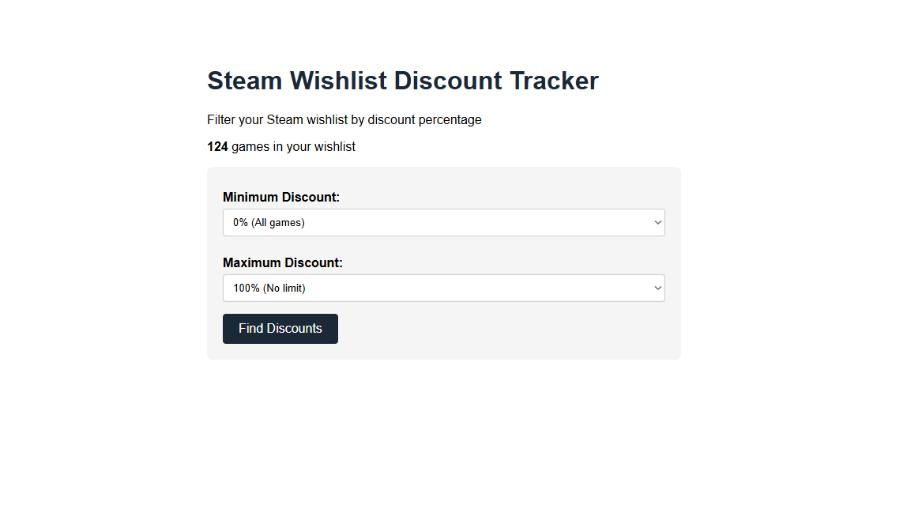
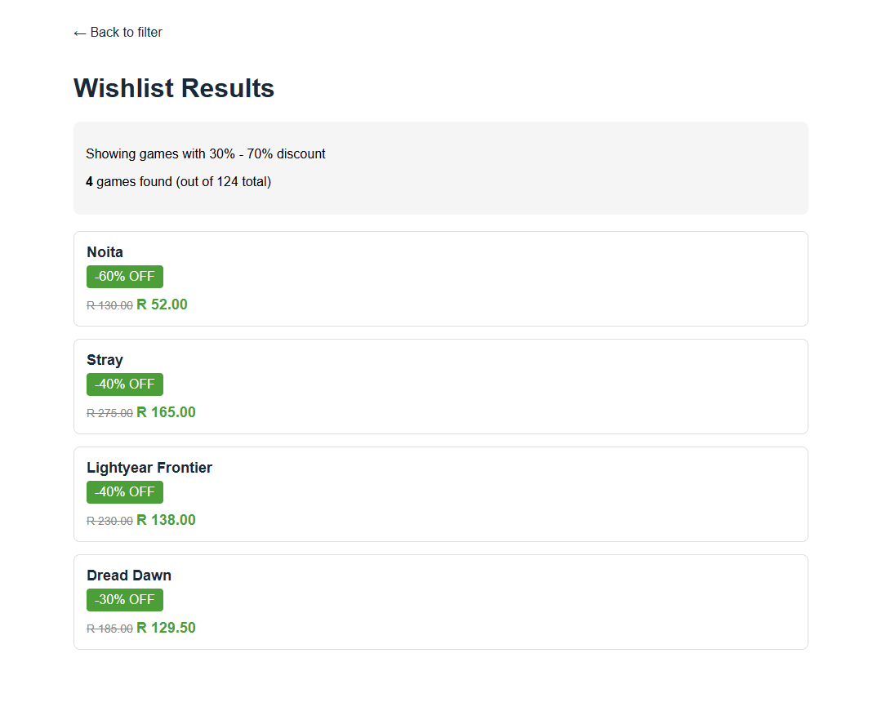

# Steam Wishlist Discount Tracker

A Flask-based web application that tracks discounts on your Steam wishlist. Uses concurrent API calls to fetch real-time pricing data and provides filtering by discount percentage.

**Purpose:** Portfolio project demonstrating Flask backend development, multi-API integration, concurrent processing, and full-stack web development.




## What It Does

- Fetches your Steam wishlist using Steam's IWishlistService API
- Retrieves real-time pricing and discount data for each game
- Filters games by discount percentage ranges (10%-20%, 30%-50%, etc.)
- Displays results in a clean web interface
- Uses concurrent processing to fetch 100+ games in ~15 seconds

## Key Features

**Multi-API Integration**
- Steam IWishlistService API for wishlist data
- Steam App Details API for pricing information
- Region-specific pricing (ZAR/South Africa)
- Handles edge cases: free games, unreleased titles, missing data

**Concurrent Processing**
- ThreadPoolExecutor for parallel API calls
- Configurable worker threads (default: 10)
- Rate limiting to respect Steam's API constraints
- ~75% faster than sequential processing

**Smart Filtering**
- Filter by discount ranges (0-100%)
- Automatic sorting by discount percentage
- Excludes unreleased games from results
- Shows both original and discounted prices

**Caching**
- Application-level caching for instant subsequent requests
- No redundant API calls during active session
- First load: ~15 seconds, subsequent: instant

**Error Handling**
- Network timeout handling
- JSON parsing validation
- Partial result returns (doesn't crash if some games fail)
- Graceful degradation

## Tech Stack

- **Backend:** Flask (Python 3.8+)
- **Concurrency:** concurrent.futures.ThreadPoolExecutor
- **Frontend:** HTML5, CSS3, Vanilla JavaScript
- **APIs:** Steam Web API (IWishlistService + App Details)
- **Configuration:** python-dotenv

## Project Structure
```
steam-wishlist-tracker/
├── app.py                      # Flask application & routes
├── config.py                   # Configuration management
├── services/
│   └── steam_service.py        # Steam API integration
├── templates/
│   ├── index.html              # Filter form
│   └── wishlist.html           # Results display
├── .env                        # Steam ID (not committed)
├── requirements.txt
└── README.md
```

## Getting Started

### Prerequisites
- Python 3.8+
- Steam account with games in wishlist
- Your Steam ID (find at https://steamid.io/)

### Installation
```bash
# Clone repository
git clone <your-repo-url>
cd steam-wishlist-tracker

# Create virtual environment
python -m venv venv
source venv/bin/activate  # Windows: venv\Scripts\activate

# Install dependencies
pip install -r requirements.txt

# Configure environment
echo "STEAM_ID=your_steam_id_here" > .env

# Run application
python app.py
```

### Usage
- **Visit** http://localhost:5000


### Technical Decisions:

### Why Threading?
Sequential API calls took ~60 seconds for 127 games. Threading with 10 workers reduced this to ~15 seconds while respecting rate limits.
### Why Application-Level Cache?
Steam prices don't change every second. Caching eliminates redundant API calls during active sessions, improving UX.
### Region Handling:
Added cc=ZA parameter to ensure correct currency (ZAR) instead of defaulting to USD.


## Acknowledgment

This README was created with the assistance of AI (ChatGPT by OpenAI) to ensure clarity and consistency.

## License

Personal learning project - feel free to reference or adapt for educational purposes.
